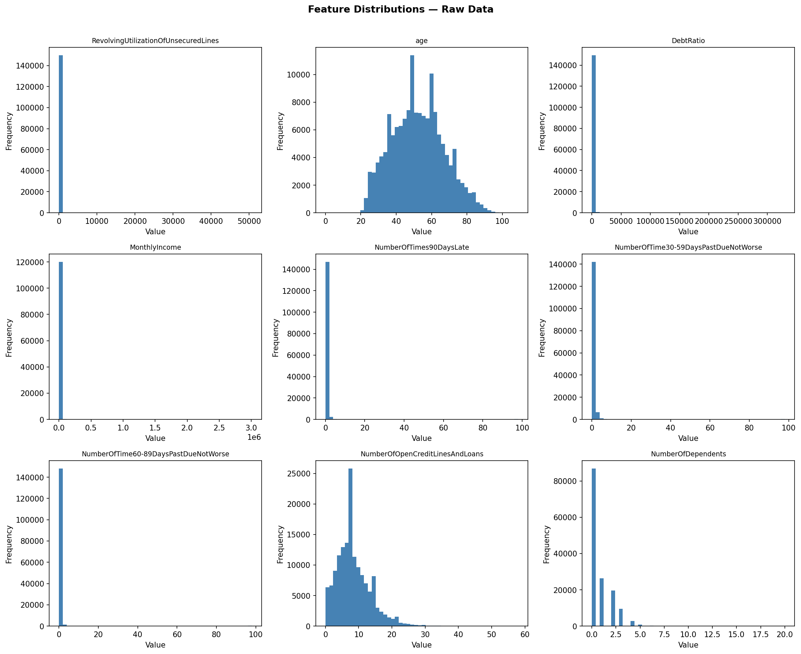
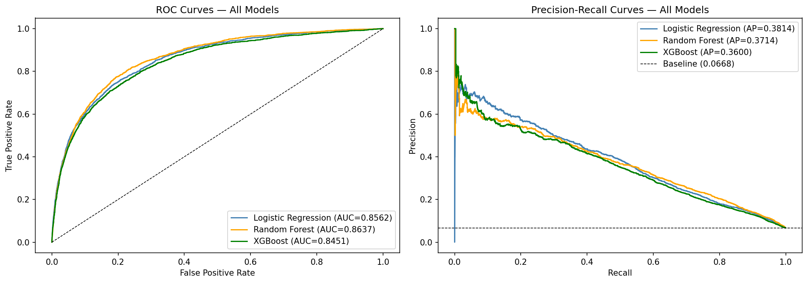
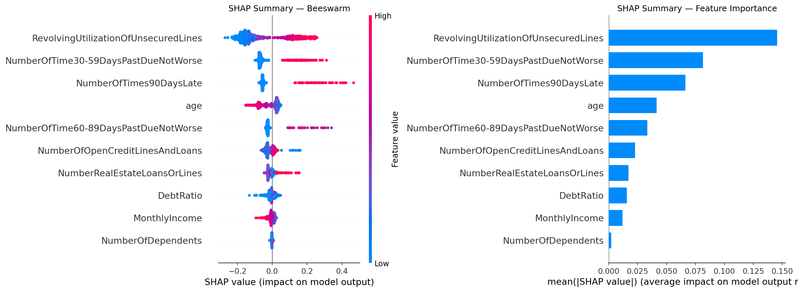
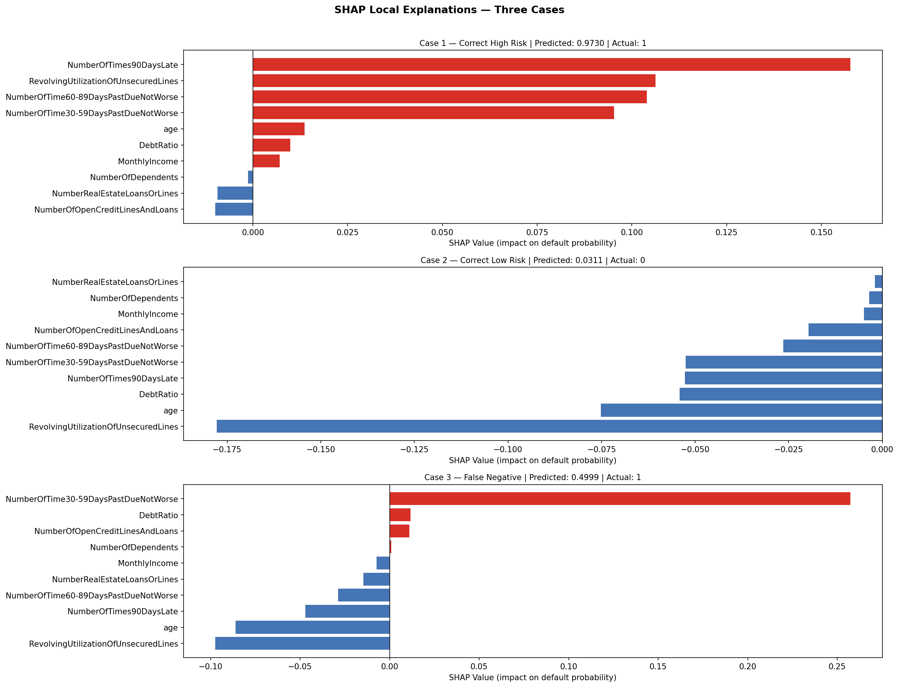
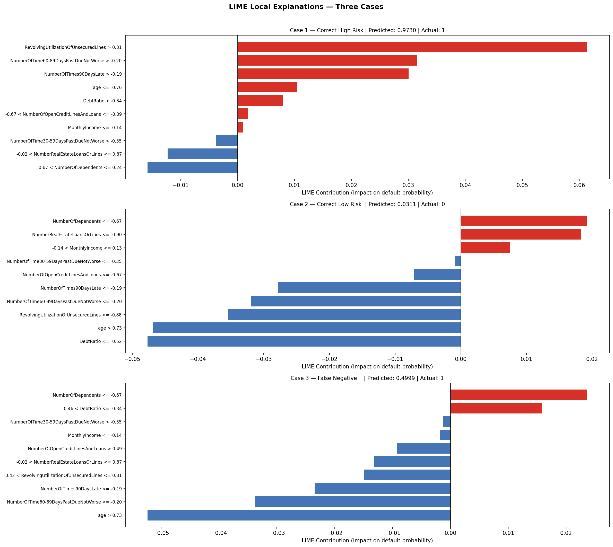
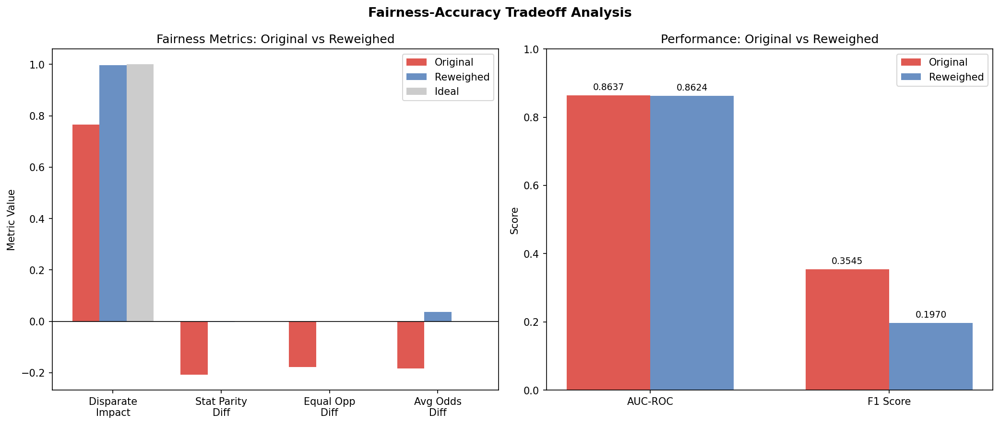

# Explainable Credit Risk Prediction System

An end-to-end responsible AI pipeline for predicting borrower default risk with
SHAP and LIME explainability, AIF360 fairness auditing, and a deployed Streamlit
application for loan officer decision support. Built on 150,000 historical loan
records from the Kaggle Give Me Some Credit competition.

---

## Live Demo

[Launch App](PASTE_STREAMLIT_URL_HERE)

---

## Results Summary

| Model | AUC-ROC | AUC-PR | F1 |
|-------|---------|--------|----|
| Logistic Regression | 0.8562 | 0.3814 | 0.3262 |
| **Random Forest** | **0.8637** | 0.3714 | 0.3545 |
| XGBoost | 0.8451 | 0.3600 | 0.3582 |

Random Forest achieves **0.8637 AUC-ROC** — within striking distance of the
Kaggle competition winning score of 0.869.

### Fairness Audit Results

| Metric | Original Model | Fair Model | Threshold |
|--------|---------------|------------|-----------|
| Disparate Impact | 0.7661 ❌ | 0.9974 ✅ | ≥ 0.80 |
| Statistical Parity Difference | -0.2076 ❌ | -0.0026 ✅ | ±0.10 |
| Equal Opportunity Difference | -0.1777 ❌ | -0.0007 ✅ | ±0.10 |
| Average Odds Difference | -0.1840 ❌ | 0.0368 ✅ | ±0.10 |

Near-perfect fairness achieved via Reweighing at a cost of **0.0013 AUC-ROC**.

---

## Project Structure

```
credit-risk-explainability/
│
├── data/
│   └── raw/
│       ├── cs-training.csv
│       └── cs-test.csv
│
├── models/
│   ├── logistic_regression.pkl
│   ├── random_forest.pkl
│   ├── rf_fair.pkl
│   ├── xgboost_model.json
│   ├── preprocessor.pkl
│   ├── feature_names.pkl
│   ├── clf_results.pkl
│   └── shap_values.pkl
│
├── images/
│   ├── feature_distributions.png
│   ├── roc_curves.png
│   ├── shap_summary.png
│   ├── shap_force_plot.png
│   ├── lime_explanation.png
│   └── fairness_metrics.png
│
├── app.py
├── notebook.ipynb
├── requirements.txt
└── README.md
```

---

## Dataset

**Source:** [Give Me Some Credit](https://www.kaggle.com/competitions/GiveMeSomeCredit)
— Kaggle Competition

**Size:** 150,000 labelled training observations, 101,503 unlabelled test observations

**Target variable:** `SeriousDlqin2yrs` — whether the borrower experienced 90 days
past due delinquency or worse within two years (binary: 0/1)

**Class imbalance:** 6.68% positive rate — 10,026 defaults against 139,974
non-defaults. AUC-ROC and Precision-Recall AUC are used as primary metrics.
Accuracy is a meaningless metric for this problem.

**Key features:**

| Feature | Description |
|---------|-------------|
| RevolvingUtilizationOfUnsecuredLines | Balance-to-limit ratio on credit cards |
| age | Borrower age in years |
| NumberOfTime30-59DaysPastDueNotWorse | Times 30-59 days late in last 2 years |
| DebtRatio | Monthly debt payments / gross income |
| MonthlyIncome | Self-reported monthly income |
| NumberOfTimes90DaysLate | Times 90+ days late in last 2 years |
| NumberOfDependents | Number of dependents excluding self |

---

## Methodology

### Phase 1 — Exploratory Data Analysis



EDA revealed four critical data quality issues requiring domain-knowledge
driven cleaning decisions before modelling:

**Class imbalance** — 6.68% default rate confirmed AUC-ROC and Precision-Recall
AUC as the correct evaluation metrics. Accuracy is misleading for this problem.

**Missing values** — MonthlyIncome missing for 19.82% of borrowers, likely
non-random with unusual income situations driving missingness. NumberOfDependents
missing for 2.62%, likely random. Both imputed with median fit exclusively on
training data.

**Sentinel values** — the past due count features contain values of 96, 97, and
98 representing data entry errors rather than genuine counts. These were replaced
with NaN and treated as missing values rather than allowing error codes to be
interpreted as extreme delinquency counts.

**Extreme outliers** — RevolvingUtilization has a maximum of 50,708 against a
theoretical 0-1 range. DebtRatio reaches 329,664 driven by division-by-zero
artifacts where zero income borrowers produced undefined ratios. Both capped using
domain-knowledge thresholds and 99th percentile caps respectively.

### Phase 2 — Preprocessing Pipeline

A scikit-learn `ColumnTransformer` pipeline chains every transformation into a
single reusable object fit exclusively on training data:

**Log pipeline** applied to RevolvingUtilization, DebtRatio, and MonthlyIncome:
median imputation → `log(x+1)` transformation to reduce right skew →
StandardScaler normalisation.

**Standard pipeline** applied to all count and discrete features:
median imputation → StandardScaler normalisation.

**SMOTETomek** resampling applied after the train/test split to training data
only — generating synthetic minority class examples via SMOTE interpolation and
removing borderline majority class examples via Tomek links. Training set balanced
from 6.68% to 50% default rate across 221,392 observations.

### Phase 3 — Modelling and Evaluation



Three models of increasing complexity trained on the resampled training set and
evaluated on the original unmodified 30,000 observation test set:

**Logistic Regression** — interpretable baseline with L2 regularisation (C=0.1).
Coefficient analysis confirms economically sensible learned relationships —
revolving utilization and past delinquency increase default risk, age and income
reduce it. The negative DebtRatio coefficient reveals the non-linear relationship
between debt burden and default that a linear model cannot fully capture.

**Random Forest** — 200 trees with max depth 10 and min samples leaf 50.
Achieves the highest AUC-ROC at 0.8637 and is selected as the primary model
for the explainability layer.

**XGBoost** — gradient boosting with scale_pos_weight for class imbalance
handling. Underperforms both models on this dataset — a genuine finding
reflecting the problem structure. With 10 features exhibiting strong direct
linear relationships with the target there are insufficient complex nonlinear
interactions for XGBoost's gradient boosting to exploit over simpler ensemble
methods. No single model dominates across all metrics — each optimises different
aspects of the error distribution.

### Phase 4 — Explainability

#### SHAP Global Explanation



SHAP (SHapley Additive exPlanations) uses game theory to attribute exact
contributions to each feature across all predictions. The beeswarm plot reveals
three pieces of information simultaneously per feature: overall importance
(vertical position), direction of influence (horizontal position), and whether
high or low feature values drive risk (colour).

**Feature importance by mean absolute SHAP value:**

| Feature | Mean |SHAP| |
|---------|-------------|
| RevolvingUtilizationOfUnsecuredLines | 0.1456 |
| NumberOfTime30-59DaysPastDueNotWorse | 0.0816 |
| NumberOfTimes90DaysLate | 0.0663 |
| age | 0.0414 |
| NumberOfTime60-89DaysPastDueNotWorse | 0.0335 |

Credit utilization and payment history dominate default prediction — consistent
with credit scoring domain knowledge and validating the model has learned
trustworthy relationships.

#### SHAP Local Explanations



Force plots generated for three deliberately chosen cases:

**Case 1 — Correct High Risk (probability 0.973):** Four delinquency features
fire simultaneously. NumberOfTimes90DaysLate contributes the largest single
SHAP value at +0.155. The model is correct and confident because multiple
independent risk signals align.

**Case 2 — Correct Low Risk (probability 0.031):** Every feature pushes toward
safety. Low revolving utilization contributes -0.175 alone — the strongest
single feature contribution observed across all cases.

**Case 3 — False Negative (probability 0.4999, actual default):** A strong
delinquency signal at +0.26 is narrowly outweighed by protective signals from
low revolving utilization (-0.11) and older age (-0.09). This reveals the
model's primary blind spot: situational default risk driven by acute financial
shocks is harder to detect than chronic financial mismanagement.

#### SHAP vs LIME Comparison



LIME (Local Interpretable Model-agnostic Explanations) fits a simple linear
model locally around each prediction using perturbed samples. Comparing SHAP
and LIME across the same three cases:

**Where they agree** — Cases 1 and 2 show consistent dominant features across
both frameworks. Explanations for confident predictions are robust and suitable
for communicating to loan officers.

**Where they disagree** — Case 3 (the false negative) shows meaningful
divergence. SHAP identifies NumberOfTime30-59DaysPastDueNotWorse as the
dominant risk signal. LIME identifies NumberOfDependents and DebtRatio. Both
are plausible interpretations of a genuinely borderline prediction reflecting
different assumptions about the local feature space.

**Practical implication:** Explanations for confident predictions can be
presented to decision makers with confidence. Explanations for borderline
predictions should be treated as hypotheses requiring human review.

### Phase 5 — Fairness Audit



Credit decisions are subject to equal credit opportunity law. A model producing
systematically different outcomes for different demographic groups — even without
explicitly using protected characteristics — can constitute proxy discrimination.

**Age group analysis:**

| Age Group | Default Rate |
|-----------|-------------|
| Younger borrowers (below median age) | 9.48% |
| Older borrowers (at or above median age) | 3.97% |

The actual default rate difference justifies greater caution toward younger
borrowers. However the model's Disparate Impact of 0.766 represents treatment
approximately four times more restrictive than the actual risk difference
warrants — overcorrection rather than statistically justified discrimination.

**Reweighing** assigns instance weights to training examples based on group
membership and label combination, upweighting correctly repaid loans from younger
borrowers to give the model greater incentive to identify them as safe.

**The fairness-accuracy tradeoff:**

Near-perfect fairness across all four metrics was achieved at a cost of
**0.0013 AUC-ROC** — statistically negligible. The original model's age bias
was not driven by genuine predictive signal but by overcorrection on correlated
features. A lender deploying the original model would face regulatory exposure
under equal credit opportunity law for essentially zero gain in predictive
performance. The reweighed model is the recommended production model.

---

## Key Findings

**Random Forest outperforms XGBoost** on this structured tabular dataset —
demonstrating that architectural complexity does not guarantee superior
performance when the problem has strong direct feature-target relationships
amenable to simpler ensemble methods.

**The false negative case study** reveals the model's primary blind spot:
borrowers who default due to acute financial shocks rather than chronic
mismanagement appear financially healthy on most metrics, causing the model
to underestimate their risk. This limitation cannot be addressed without
additional features such as recent income changes or employment status.

**Fairness at negligible cost** — Reweighing eliminated age-based bias across
all four AIF360 metrics while reducing AUC-ROC by only 0.0013. The responsible
AI choice is unambiguous: deploy the fair model.

**SHAP-LIME agreement as an explanation robustness test** — when both
frameworks agree on dominant features the explanation is trustworthy. When
they diverge the prediction is borderline and human review is warranted.

---

## Setup and Usage

### Requirements

```
pandas
numpy
matplotlib
seaborn
scikit-learn
imbalanced-learn
xgboost
shap
lime
aif360
streamlit
pyngrok
```

Install all dependencies:

```bash
pip install -r requirements.txt
```

### Running the Notebook

Open `notebook.ipynb` in Google Colab or a local Jupyter environment.
Run cells sequentially from top to bottom. Download `cs-training.csv` and
`cs-test.csv` from the Kaggle competition linked above and upload before
running Phase 1.

### Running the App

```bash
streamlit run app.py
```

On Google Colab use ngrok to expose the local server:

```python
from pyngrok import ngrok
ngrok.set_auth_token("YOUR_TOKEN")
public_url = ngrok.connect(8501)
print(public_url)
```

---

## Further Work

**Intersectional fairness analysis** — auditing for combined demographic
attributes such as age and income simultaneously rather than age alone, using
AIF360's multi-attribute fairness metrics.

**Calibration** — applying isotonic regression calibration to align probability
outputs with true default rates, improving the interpretability of the
uncertainty estimates presented to loan officers.

**Conformal prediction** — replacing point probability estimates with
statistically guaranteed prediction sets, providing loan officers with formally
valid uncertainty quantification.

**Additional features** — incorporating employment status, recent income
changes, and macroeconomic indicators to address the model's blind spot for
situational default risk identified in the false negative case study.

**Causal inference extension** — moving beyond correlation-based SHAP
attributions toward causal explanations using tools like DoWhy, providing
stronger guarantees about which features genuinely cause default rather than
merely correlate with it.

---

## Tech Stack

Python, Pandas, NumPy, Scikit-learn, Imbalanced-learn, XGBoost, SHAP, LIME,
AIF360, Matplotlib, Seaborn, Streamlit, Google Colab, ngrok

---

## Data Source

He, H., & Garcia, E. A. (2009). Give Me Some Credit.
Kaggle Competition.
https://www.kaggle.com/competitions/GiveMeSomeCredit
